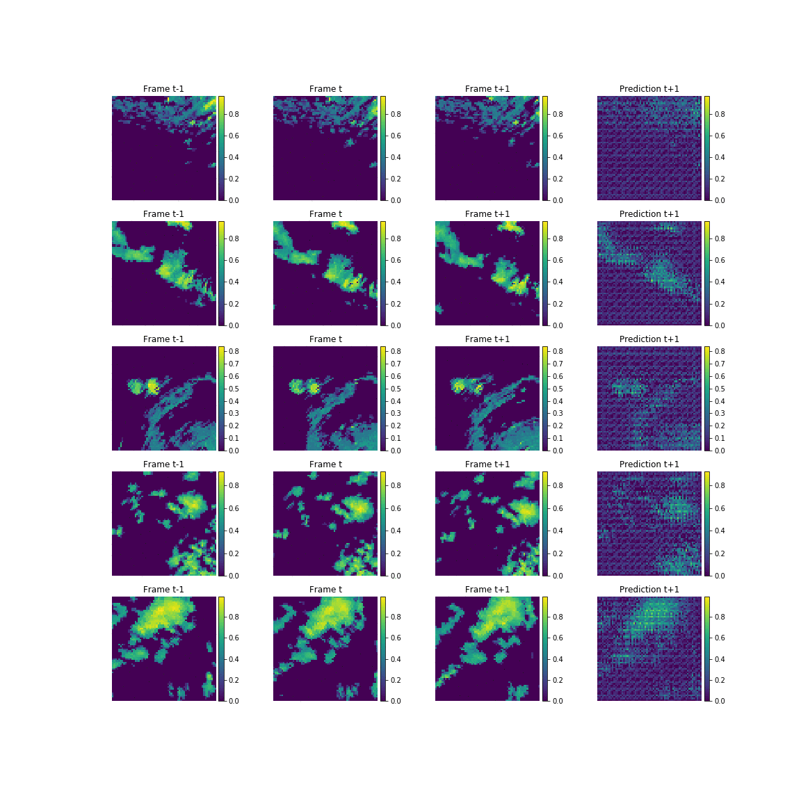

# ADL4CV_project
This is a project in the subject "Advanced Deep Learning for Computer Vision".

The goal is the prediction of rainy areas from radar images with deep generative networks.

Weather data source: https://opendata.dwd.de/weather/radar/composit/rx/
 (Note: this server is continuously updated and contains the files for measurements of the past 48 hours. Older data is deleted.
 See details at: https://www.dwd.de/DE/leistungen/opendata/hilfe.html?nn=16102&lsbId=625220 (first file, bottom of page 4))

The files contain rain measurements converted to unitless pixel intensities (0-255). To get back the values in mm/h, use the following formulas:
 https://www.dwd.de/DE/leistungen/radolan/radolan_info/radolan_radvor_op_komposit_format_pdf.pdf?__blob=publicationFile&v=11 (page 10)
 https://web.archive.org/web/20160113151652/http://www.desktopdoppler.com/help/nws-nexrad.htm#rainfall%20rates  

The radar maps are recorded with 5 minutes frequency. The maps are uniformly masked and cover a 900km x 900km area over Germany and some adjacent areas. Spatial resolution is 1km * 1km per pixel. The data is stored in binary files and once downloaded, it can be loaded with the src.get_data() method.

The gif below shows the evolution of some example predictions during training (from the validation set) by using two frames as input to predict the following frame. The GAN used here has two discriminators (spatial+temporal) with Wasserstein loss and gradient penalty. This particular training had 5000 iterations and predictions are shown at every 200th iteration.

